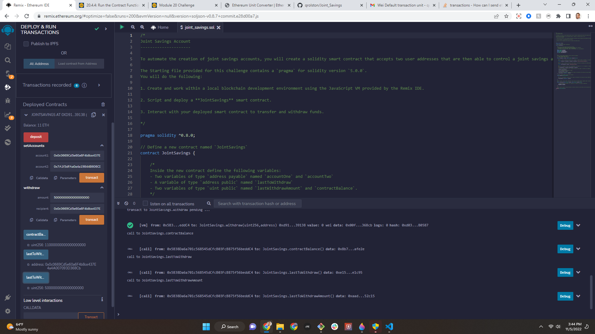

## Joint Savings

Joint Savings (stored as **joint_savings.sol**) is a solidity application that allows clients to send ether back and forth to one another.

We are sending and recording etherium transactions using ganache.

**Initial Deployment of Contract**

**Set Account 1 & Account 2**

**Completion of initial deposits**
* Transaction 1: Send 1 ether as wei.
* Transaction 2: Send 10 ether as wei.
* Transaction 3: Send 5 ether.

**Withdrawl #1 - 5 ether to Account1**

**Withdrawl #2 - 10 ether to Account2**

## Technologies

**joint_savings.sol** is a solidity application. It leverages pragma solidity 0.8.0

## Installation Guide

This file is accessible via Remix IDE in your browser

## Contributors

*Brought to you by Quianna Rolston*
> * [Email @ Quianna](quiannarolston@gmail.com)

> * [LinkedIn](https://www.linkedin.com/in/quianna-rolston/)

---

## License

UC Berkeley - FinTech Bootcamp '22